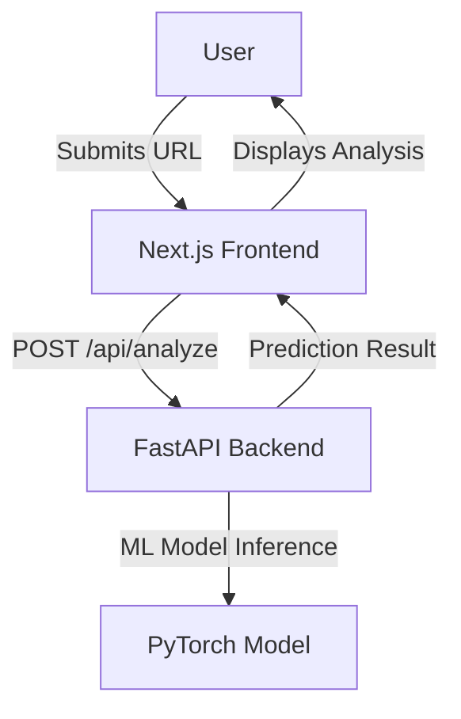
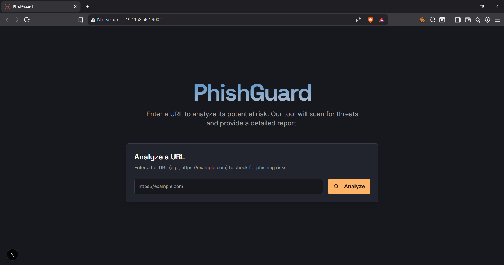

# PhishGuard AI

PhishGuard AI is an advanced phishing URL detection system that leverages machine learning to identify and analyze potentially malicious links. It provides a modern web interface for users to check the safety of URLs and a robust backend powered by a neural network model trained on real phishing data.

## Features

### Backend
- **Phishing Detection API**: FastAPI-based REST endpoint for phishing prediction.
- **AI-Powered**: Uses a PyTorch neural network trained on a rich set of URL features.
- **Feature Extraction**: Analyzes URL structure, domain age, SSL status, suspicious keywords, and more.
- **Explainable Results**: Returns risk level, security score, and explanations for each prediction.
- **Rate Limiting**: Protects the API from abuse.

### Frontend
- **Modern UI**: Built with Next.js and Tailwind CSS for a responsive experience.
- **URL Analysis Form**: Users can submit URLs and receive instant risk analysis.
- **Detailed Reports**: Visualizes risk level, security score, and security issues.
- **Toast Notifications**: User-friendly error and status messages.

## Architecture



- The frontend sends URL analysis requests to its own `/api/analyze` route, which proxies to the backend's `/api/predict` endpoint.
- The backend extracts features, runs the ML model, and returns a detailed risk assessment.

## Screenshot



## Setup Instructions

### Prerequisites
- Python 3.8+
- Node.js 18+
- (Optional) CUDA for GPU acceleration

### Backend Setup
1. Navigate to the backend directory:
   ```sh
   cd backend
   ```
2. Install dependencies:
   ```sh
   pip install -r requirements.txt
   ```
3. Start the FastAPI server:
   ```sh
   uvicorn main:app --reload --host 0.0.0.0 --port 8000
   ```

### Frontend Setup
1. Navigate to the frontend directory:
   ```sh
   cd frontend
   ```
2. Install dependencies:
   ```sh
   npm install
   ```
3. Start the Next.js development server:
   ```sh
   npm run dev
   ```
4. Open [http://localhost:3000](http://localhost:3000) in your browser.

## Usage
- Enter a URL in the input form on the homepage.
- Click "Analyze" to receive a risk assessment, including risk level, security score, and explanations.
- The backend will classify the URL as "Phishing" or "Legitimate" and provide details.

## Tech Stack

### Backend
- **FastAPI**: Web framework for the REST API
- **PyTorch**: Neural network for phishing detection
- **scikit-learn, pandas, joblib**: Data processing and model utilities
- **tldextract, requests, beautifulsoup4, python-whois**: Feature extraction

### Frontend
- **Next.js**: React-based web framework
- **Tailwind CSS**: Utility-first CSS framework
- **Radix UI**: Accessible UI components
- **TypeScript**: Type safety

## Model Training
- The backend model is trained using `backend/model/train.py` on a labeled phishing dataset (`backend/data/phishing_dataset.csv`).
- To retrain:
  1. Place your dataset in `backend/data/phishing_dataset.csv`.
  2. Run:
     ```sh
     python backend/model/train.py
     ```
  3. This will update the model and scaler files in `backend/model/`.

## Contributing
- Fork the repository and create a feature branch.
- Submit pull requests with clear descriptions.
- For major changes, please open an issue first to discuss.

*PhishGuard AI – Protecting users from phishing threats with the power of AI.*

## Disclaimer

PhishGuard AI is a machine learning–based system, and while it is trained on real phishing data and engineered to detect threats accurately, predictions may occasionally vary or produce false positives/negatives. Always use additional verification methods when dealing with suspicious URLs.

